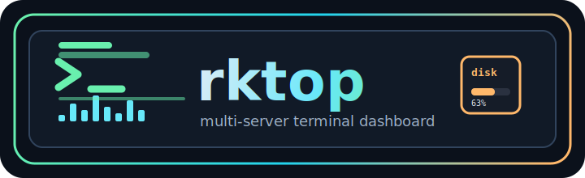
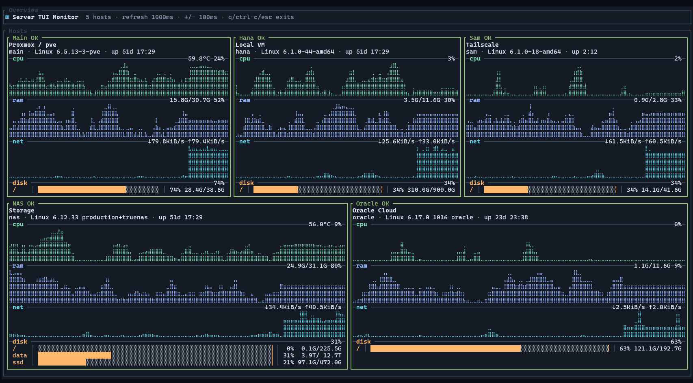
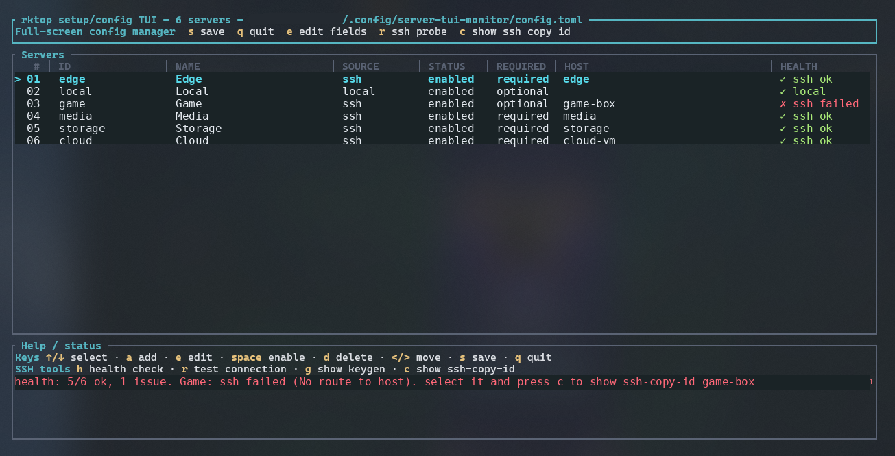

<div align="center">
  

  <p><strong>A btop-inspired TUI dashboard for monitoring multiple Linux servers over SSH.</strong></p>

  <p>
    
    
    
    
  </p>

  
</div>

## Why rktop?

`rktop` is a live terminal dashboard for a small rack, homelab, or fleet of Linux boxes. It collects read-only CPU, RAM, network, disk, uptime, kernel, hostname, and optional CPU temperature metrics, then lays them out as btop-style server cards.

- **Live by default** — running `rktop` opens the live TUI, like `htop`/`btop`.
- **Multi-host over SSH** — Linux hosts are collected with non-interactive key auth.
- **No remote install required** — the SSH collector runs fixed read-only shell probes.
- **Fast refresh friendly** — SSH connection multiplexing reuses sessions, and failed optional hosts back off so powered-off boxes do not stall every refresh.
- **Optional hosts** — powered-off boxes can simply disappear instead of breaking the dashboard.
- **Polished terminal UI** — braille history graphs, rule-filled sections, aligned disk rows, and adaptive layout.
- **Storage-friendly** — multiple disks, disk aliases, row limits, and ZFS/TrueNAS-style mount cleanup.

## Supported environments

`rktop` is Linux-first. It does not install agents on monitored machines; it reads standard Linux system files and commands locally or through SSH.

### Machine running `rktop`

| environment | status | notes |
| --- | --- | --- |
| Debian/Ubuntu Linux x86_64 | supported | official GitHub Release `.deb` target |
| Other Linux distributions | supported with portable release or source build | portable release needs no Rust; source build needs Rust stable |
| Linux arm64/armhf | buildable | `scripts/build-deb.sh` supports `arm64`/`armhf`, but current release assets are amd64 only |
| macOS | not supported/tested | may build partially, but local collection expects Linux `/proc` and Linux tool output |
| Windows 10/11 | supported for SSH monitoring | native `rktop.exe` can monitor Linux SSH hosts; local Windows metrics are not implemented yet |

### Monitored hosts

| target | status | notes |
| --- | --- | --- |
| Generic Linux server over SSH | supported | needs key auth and non-interactive `ssh <host> true` |
| Local Linux machine | supported | `source = "local"` / add “local machine” in `rktop config` |
| Proxmox host/VM | supported via SSH | treated as a normal Linux host; Proxmox API is not implemented yet |
| Oracle/VPS Linux host | supported via SSH | treated as a normal Linux host |
| Linux NAS / TrueNAS SCALE | supported via SSH when Linux shell access works | ZFS pools are summarized when `zpool` is available; TrueNAS API is not implemented yet |
| TrueNAS CORE / FreeBSD / BSD | not supported | collector expects Linux `/proc` |
| macOS remote | not supported | collector expects Linux `/proc` and Linux `df` output |
| Windows remote | not supported | no WinRM/PowerShell collector |

Remote Linux hosts need a POSIX shell plus common Linux files/commands: `/proc/loadavg`, `/proc/uptime`, `/proc/cpuinfo`, `/proc/meminfo`, `/proc/net/dev`, `df -kP`, `awk`, `grep`, `hostname`, and `uname`. CPU temperature is shown only when Linux hwmon exposes `coretemp` or `k10temp`.

## Quick start

### Portable release (recommended for trying it)

Portable downloads need **no Rust** and keep the binary, README, license, and starter config in one folder. Delete the folder to remove it.

Linux x86_64:

```bash
wget https://github.com/Kinetic27/rktop/releases/latest/download/rktop_0.1.0_linux_x86_64.tar.gz
tar -xzf rktop_0.1.0_linux_x86_64.tar.gz
cd rktop
./rktop config
./rktop doctor
./rktop
```

Windows 10/11 PowerShell:

```powershell
Invoke-WebRequest https://github.com/Kinetic27/rktop/releases/latest/download/rktop_v0.1.0_windows_x86_64.zip -OutFile rktop.zip
Expand-Archive .\rktop.zip -DestinationPath .
cd .\rktop
.\rktop.exe config
.\rktop.exe doctor
.\rktop.exe
```

Portable mode uses the `config.toml` placed beside the executable before falling back to system/user config paths.

### Debian/Ubuntu `.deb`

The `.deb` also needs **no Rust**. It installs `rktop` system-wide and depends on `openssh-client`:

```bash
wget https://github.com/Kinetic27/rktop/releases/latest/download/rktop_0.1.0_amd64.deb
sudo apt install ./rktop_0.1.0_amd64.deb
rktop config
rktop doctor
rktop
```

### Windows standalone installer

If you want `rktop` on your user `PATH`, run the PowerShell installer:

```powershell
powershell -ExecutionPolicy ByPass -c "irm https://raw.githubusercontent.com/Kinetic27/rktop/main/scripts/install.ps1 | iex"
```

For unattended installs, set `RKTOP_NON_INTERACTIVE=1` on the shell that runs the downloaded installer:

```powershell
$env:RKTOP_NON_INTERACTIVE=1; irm https://raw.githubusercontent.com/Kinetic27/rktop/main/scripts/install.ps1 | iex
```

The installer downloads the latest Windows release zip, installs `rktop.exe` to `%LOCALAPPDATA%\rktop\bin`, and adds that directory to your user `PATH`. You can override with `RKTOP_INSTALL_DIR`, pin a version with `RKTOP_VERSION=v0.1.0`, or skip PATH updates with `RKTOP_SKIP_PATH=1`.

Windows runs `rktop.exe` natively, but only SSH monitoring of Linux hosts is supported for now. Do not add the Windows machine as `source = "local"`; local Windows CPU/RAM/disk collection needs a future Windows collector.

### Source build / development

Building from source **does require Rust**. The helper script intentionally creates a clone-local portable install so it does not touch `~/.local/bin` or global config paths:

```bash
git clone https://github.com/Kinetic27/rktop.git
cd rktop
scripts/install.sh
./.rktop/bin/rktop config
./.rktop/bin/rktop doctor
./.rktop/bin/rktop
```

Source portable mode uses:

```text
./.rktop/bin/rktop
./.rktop/config.toml
```

The wrapper sets `RKTOP_CONFIG` to `./.rktop/config.toml`, so source-build setup stays inside the clone. For regular users who do not want Rust, use the portable release or `.deb` instead.

### First-run setup

`rktop config` creates an intentionally empty first-run config when needed, then opens the full-screen setup manager where you add servers from `~/.ssh/config`, type a direct `user@host` target, add the local Linux machine, test SSH, show the exact `ssh-copy-id` command when needed, reorder entries, and save. `rktop setup` is an alias for the same setup manager; `rktop edit` opens the raw TOML in `$VISUAL`/`$EDITOR` as a fallback.

Runtime config lookup order is:

```text
1. --config PATH
2. $RKTOP_CONFIG
3. ./config.toml beside the rktop executable, when present
4. ~/.config/rktop/config.toml or $XDG_CONFIG_HOME/rktop/config.toml
5. /etc/rktop/config.toml on Linux
6. legacy ~/.config/server-tui-monitor/config.toml
```

<p align="center">
  
</p>

The SSH collector is intentionally read-only and non-interactive. Password prompts are disabled, remote installs/writes are not attempted during monitoring, and every SSH server must already work with key auth. Monitoring and `doctor` use bounded SSH calls with `-n`, `BatchMode=yes`, password and keyboard-interactive auth disabled, one connection attempt, and zero password prompts:

```bash
ssh -o BatchMode=yes server-1 true
```

## Config

Use the full-screen setup manager for normal configuration:

```bash
rktop config
```

The setup manager creates the platform config file on first run and lets you:

- add hosts from `~/.ssh/config`
- add a direct SSH target such as `user@example.com`
- add the local Linux machine
- test SSH connectivity
- show the exact `ssh-keygen` / `ssh-copy-id` commands when key auth is not ready
- enable, disable, delete, and reorder hosts
- mark hosts as optional so powered-off boxes are hidden in the live dashboard
- edit display names, IDs, disk row limits, and disk mount aliases
- run background health checks while you configure

`rktop setup` opens the same TUI. `rktop edit` is only the raw TOML fallback for advanced/manual edits.

### Manual TOML reference

Most users do not need to write TOML by hand. If you do, prefer the user config file:

```text
Linux:   ~/.config/rktop/config.toml
Windows: %APPDATA%\rktop\config.toml
```

For a shared Linux system default, create:

```text
/etc/rktop/config.toml
```

User config wins over the system config. The old `~/.config/server-tui-monitor/config.toml` path is still read as a legacy fallback when no new config exists.

Useful fields:

| field | note |
| --- | --- |
| `refresh_interval_ms` | live refresh target in milliseconds; default `1000` |
| `id` | stable ASCII host id |
| `name` | display label in the TUI |
| `source` | `local` or `ssh` for live collection |
| `host` | SSH alias or `user@host` for SSH sources |
| `enabled` | include/exclude a host |
| `optional` | hide unreachable remote hosts; SSH entries default to optional |
| `disk_max_rows` | reserve more disk rows for storage-heavy hosts |
| `disk_aliases` | shorten mount labels, for example `{ "/mnt/tank" = "tank" }` |

Future API source variants (`proxmox`, `truenas-scale`) are parsed and preserved for config compatibility, but live collection currently uses `local` and `ssh`.

`refresh_interval_ms` is clamped to `100..60000`. In the TUI, `+`/`=` and `-` adjust it in 100ms steps. Short intervals such as `500ms` schedule refreshes at that cadence, but an individual host can only update as fast as its SSH command finishes. `rktop` enables SSH `ControlMaster=auto`/`ControlPersist=10m` to avoid paying a full SSH handshake every cycle, and optional hosts that fail are skipped briefly before retrying so an offline VM does not hold back every refresh.

## Commands

```text
rktop [--mock|--live] [--snapshot] [--once] [--config PATH]
rktop init [--config PATH] [--force|--print]
rktop setup [--config PATH]
rktop config [--config PATH]
rktop edit [--config PATH]
rktop doctor [--config PATH]
```


## Debian package releases

Build a local Debian package:

```bash
scripts/build-deb.sh
sudo apt install ./dist/rktop_0.1.0_amd64.deb
```

Tagged releases publish the `.deb` automatically:

```bash
git tag v0.1.0
git push origin v0.1.0
```

The release workflow uploads a portable Linux tarball, a Windows zip, `rktop_<version>_<arch>.deb`, and matching SHA-256 files to GitHub Releases. This is not an official Debian/Ubuntu archive package yet; it is a GitHub-hosted `.deb` for direct install.

Installed commands:

| command | purpose |
| --- | --- |
| `rktop` | preferred live TUI command |
| `stm` | legacy shorthand kept for compatibility |
| `stm-live` | explicit live TUI wrapper |
| `stm-mock` | deterministic mock data |
| `stm-snapshot` | live one-shot text snapshot |

Quit the interactive TUI with `q`, `Ctrl+C`, or `Esc`.

## Diagnostics

```bash
rktop doctor
```

Doctor checks:

- config loads successfully
- at least one server is enabled
- local collector runs on local servers
- SSH aliases are safe and key auth works without prompts
- SSH multiplexing options are available for faster repeated polling
- SSH remote Linux collector can read `/proc`, `df`, memory, network and uptime data

Required server failures make `doctor` exit non-zero. Optional server failures print `warn` and do not fail the command.

## Snapshot mode

```bash
stm-mock --snapshot
rktop --live --snapshot
```

`--snapshot` prints deterministic dashboard text for smoke tests or a read-only live snapshot for enabled hosts. No remote writes, installs, or credential prompts are performed.

## Display details

- CPU/RAM/NET/DISK use btop-style rule-filled section dividers.
- CPU/RAM/NET use full-width dynamic-range braille history graphs.
- CPU temperature is shown when Linux hwmon exposes `coretemp` or `k10temp`; 70°C+ is warning and 85°C+ is critical.
- Disk rows use aligned mount labels, high-contrast block bars, and compact capacity text.
- Disk collection prefers ZFS pool summaries from `zpool list` when available, then falls back to non-pseudo `df` mounts.
- Network values are current throughput (`B/s`, `KiB/s`, `MiB/s`, `GiB/s`), not cumulative boot-time totals.

## Branching strategy

Development uses a lightweight Git Flow style:

- `main` is stable/release-ready.
- `develop` collects the next batch of changes before release merge-back to `main`.
- Work happens on `feat/*`, `fix/*`, `docs/*`, or `chore/*` branches.

See [`docs/branching.md`](docs/branching.md) for the full workflow.

## Development

```bash
cargo fmt --check
cargo check
cargo test
cargo build --release
```

Remove the clone-local source install:

```bash
scripts/install.sh --uninstall
```
